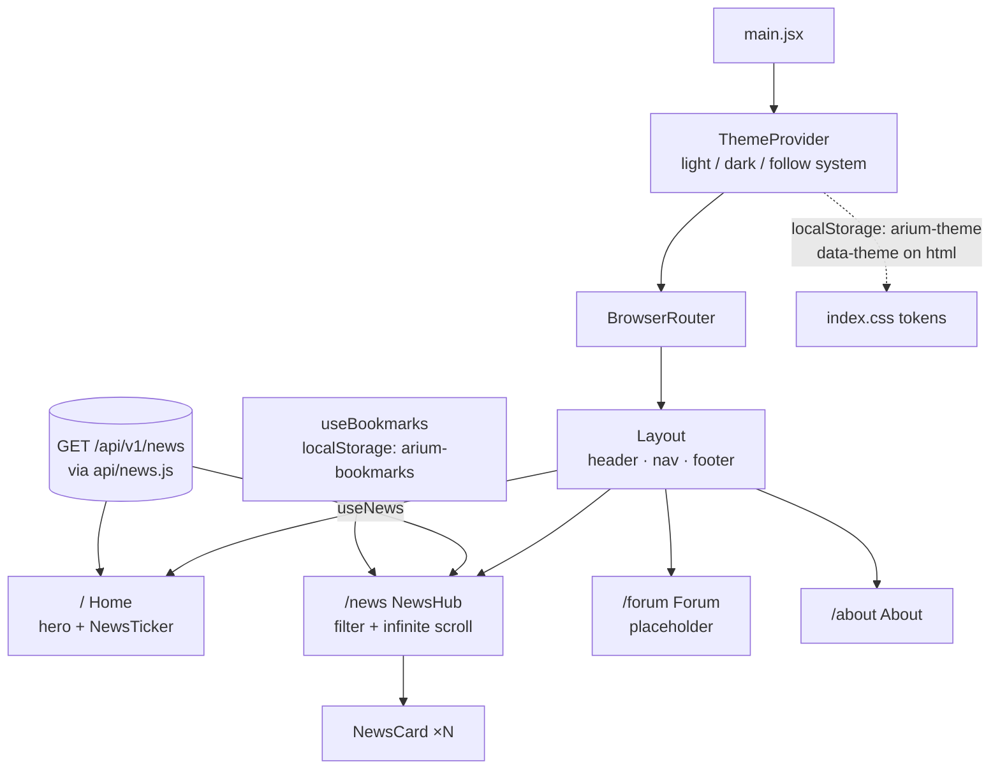

# Frontend (`arium/`)

The React single-page app for Arium: a news hub for DevOps, SRE, GitOps and DevSecOps, with a forum to come.
News comes from the API's `GET /api/v1/news`, which serves the articles gathered by the
[news collector](../backend#news-collector).

## Running against the API

The app calls the API at relative `/api/...` URLs, and both `npm run dev` and `npm run preview` proxy `/api` to
`API_PROXY_TARGET` (default `http://localhost:8080`). Nothing about the API's location is baked into the build,
and the browser never makes a cross-origin request. Start the backend (`cd ../backend && go run ./cmd/api`)
before `npm run dev`. In Docker Compose the `app` service sets `API_PROXY_TARGET=http://backend:8080`.
If Mongo has no articles yet, the News Hub shows "No stories for this topic yet"; see the
[collector](../backend#news-collector) for a one-off run.

## Software stack

| | |
|---|---|
| UI | [React 19](https://react.dev) (function components and hooks, `StrictMode`) |
| Build / dev server | [Vite 8](https://vite.dev) with `@vitejs/plugin-react` |
| Routing | [React Router 7](https://reactrouter.com) (`BrowserRouter`, nested routes) |
| Styling | [Tailwind CSS v4](https://tailwindcss.com) via `@tailwindcss/vite`, with theme tokens in `src/index.css` |
| Fonts | Inter and JetBrains Mono, self-hosted via `@fontsource` (no external font requests) |
| Linting | ESLint 10 flat config with `react-hooks` and `react-refresh` rules |
| Language | JavaScript (JSX); no TypeScript yet |

## Layout

```text
arium/
├── index.html                  # Vite entry HTML
├── vite.config.js              # React + Tailwind plugins, /api proxy for dev and preview
├── eslint.config.js
└── src/
    ├── main.jsx                # Mounts <App/> inside ThemeProvider and BrowserRouter
    ├── App.jsx                 # Route table
    ├── index.css               # Tailwind import, @theme tokens, light/dark palettes, ticker animation
    ├── components/
    │   ├── Layout.jsx          # Header with nav and theme toggle, <Outlet/>, footer
    │   ├── NewsCard.jsx        # One story: tags, title link, summary, source, bookmark button
    │   ├── NewsTicker.jsx      # Scrolling "breaking-news.feed" of the 5 latest headlines
    │   └── ThemeToggle.jsx
    ├── pages/
    │   ├── Home.jsx            # Hero, calls to action, ticker
    │   ├── NewsHub.jsx         # Topic filter + infinitely scrolling news list
    │   ├── Forum.jsx           # Placeholder
    │   └── About.jsx
    ├── api/news.js             # TOPICS and fetchNews (GET /api/v1/news)
    ├── hooks/
    │   ├── useNews.js          # Cursor paging over the news API for one topic
    │   └── useBookmarks.js     # Saved story IDs, persisted to localStorage
    └── theme/                  # ThemeContext provider, context object, useTheme hook
```

## How it works



- **Routing:** every page renders inside `Layout` through a nested route, so the header and footer stay mounted
  while the `<Outlet/>` changes.
- **News Hub:** `useNews` fetches stories newest first, 6 per request, filtered by topic tag (`devops`, `sre`,
  `gitops`, `devsecops`) on the server. An `IntersectionObserver` on a sentinel element requests the next page
  with the API's `nextCursor` when you scroll near the bottom. Changing the filter starts over from the first page
  and aborts any request still in flight. A failed request shows a retry button.
- **Ticker:** fetches the 5 newest stories once on mount, and shows a static line while loading or if the API is
  unreachable.
- **Bookmarks:** `useBookmarks` keeps a `Set` of story IDs in `localStorage`. It still works for the current
  session if storage is blocked, for example in private browsing.
- **Theme:** with no saved choice, the app follows `prefers-color-scheme`. Toggling saves an explicit
  `light`/`dark` choice and sets `data-theme` on `<html>`. The palettes are CSS variables in `index.css`, and
  Tailwind v4's `@theme` block exposes them as utilities (`bg-bg`, `text-accent`, …).
- **Data shape:** each news item is `{id, title, summary, source, url, tags, publishedAt}`, plus `fetchedAt` and
  `origin` (the collector source), which the UI doesn't use.

## Running

```sh
cd arium
npm ci
npm run dev        # dev server with hot reload
npm run lint
npm run build      # production build to dist/
npm run preview    # serve the production build (port 4173)
```

In Docker the app is built and served with `vite preview` on container port 4173, published as host port 3000.
See [`devops/docker`](../devops/docker).
