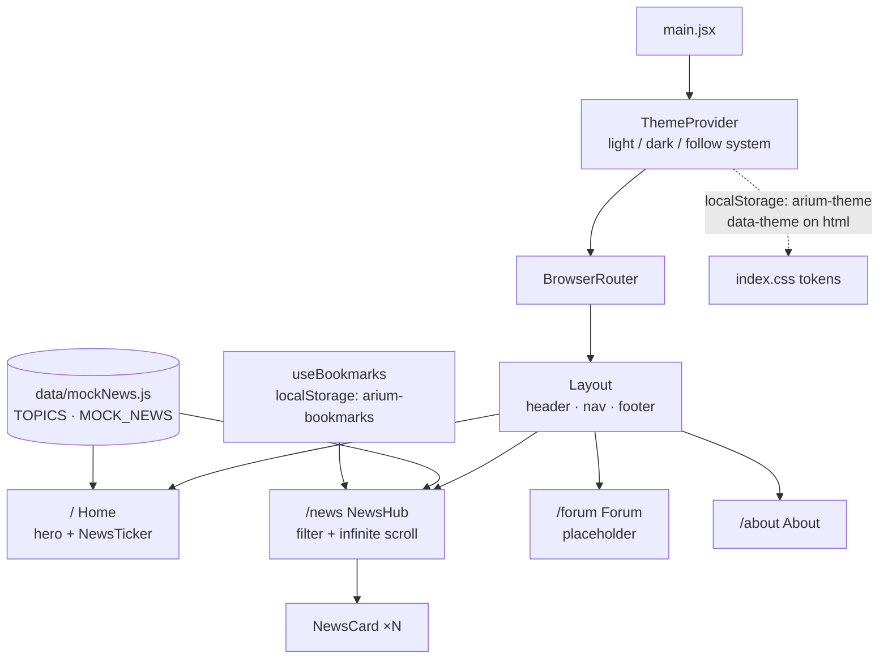

# Frontend (`arium/`)

The React single-page app for Arium: a news hub for DevOps, SRE, GitOps and DevSecOps, with a forum to come.
It currently runs on mock data. The API's `GET /api/v1/news` already serves real articles from the
[news collector](../backend#news-collector) in the same shape; switching the app over to it is the next step.

## Software stack

| | |
|---|---|
| UI | [React 19](https://react.dev) (function components and hooks, `StrictMode`) |
| Build / dev server | [Vite 8](https://vite.dev) with `@vitejs/plugin-react` |
| Routing | [React Router 7](https://reactrouter.com) (`BrowserRouter`, nested routes) |
| Styling | [Tailwind CSS v4](https://tailwindcss.com) via `@tailwindcss/vite`, with theme tokens in `src/index.css` |
| Fonts | Inter and JetBrains Mono, self-hosted via `@fontsource` (no external font requests) |
| Linting | ESLint 10 flat config with `react-hooks` and `react-refresh` rules |
| Language | JavaScript (JSX); no TypeScript yet |

## Layout

```text
arium/
├── index.html                  # Vite entry HTML
├── vite.config.js              # React + Tailwind plugins
├── eslint.config.js
└── src/
    ├── main.jsx                # Mounts <App/> inside ThemeProvider and BrowserRouter
    ├── App.jsx                 # Route table
    ├── index.css               # Tailwind import, @theme tokens, light/dark palettes, ticker animation
    ├── components/
    │   ├── Layout.jsx          # Header with nav and theme toggle, <Outlet/>, footer
    │   ├── NewsCard.jsx        # One story: tags, title link, summary, source, bookmark button
    │   ├── NewsTicker.jsx      # Scrolling "breaking-news.feed" of the 5 latest headlines
    │   └── ThemeToggle.jsx
    ├── pages/
    │   ├── Home.jsx            # Hero, calls to action, ticker
    │   ├── NewsHub.jsx         # Topic filter + infinitely scrolling news list
    │   ├── Forum.jsx           # Placeholder
    │   └── About.jsx
    ├── hooks/useBookmarks.js   # Saved story IDs, persisted to localStorage
    ├── theme/                  # ThemeContext provider, context object, useTheme hook
    └── data/mockNews.js        # TOPICS and placeholder MOCK_NEWS
```

## How it works



- **Routing:** every page renders inside `Layout` through a nested route, so the header and footer stay mounted
  while the `<Outlet/>` changes.
- **News Hub:** sorts stories newest first, filters by topic tag (`devops`, `sre`, `gitops`, `devsecops`) and
  shows 6 at a time. An `IntersectionObserver` on a sentinel element loads the next 6 when you scroll near the
  bottom, and changing the filter resets the page.
- **Bookmarks:** `useBookmarks` keeps a `Set` of story IDs in `localStorage`. It still works for the current
  session if storage is blocked, for example in private browsing.
- **Theme:** with no saved choice, the app follows `prefers-color-scheme`. Toggling saves an explicit
  `light`/`dark` choice and sets `data-theme` on `<html>`. The palettes are CSS variables in `index.css`, and
  Tailwind v4's `@theme` block exposes them as utilities (`bg-bg`, `text-accent`, …).
- **Data shape:** each news item is `{id, title, summary, source, url, tags, publishedAt}`. The collector's
  `Article` JSON uses the same field names, so replacing the mock with API data won't require component changes.

## Running

```sh
cd arium
npm ci
npm run dev        # dev server with hot reload
npm run lint
npm run build      # production build to dist/
npm run preview    # serve the production build (port 4173)
```

In Docker the app is built and served with `vite preview` on container port 4173, published as host port 3000.
See [`devops/docker`](../devops/docker).
