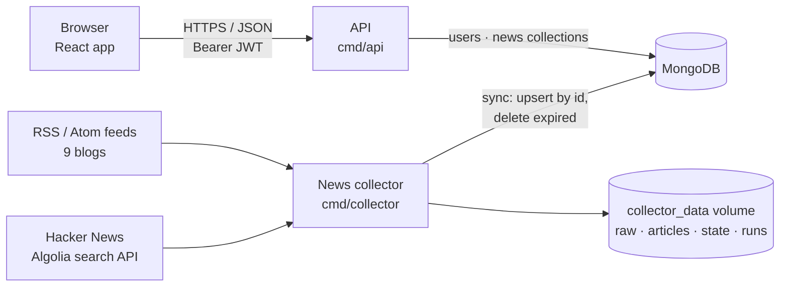
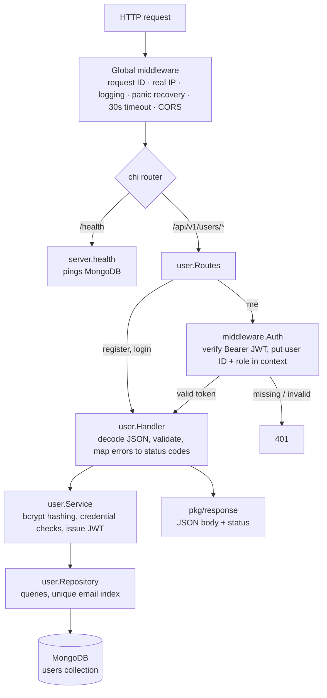
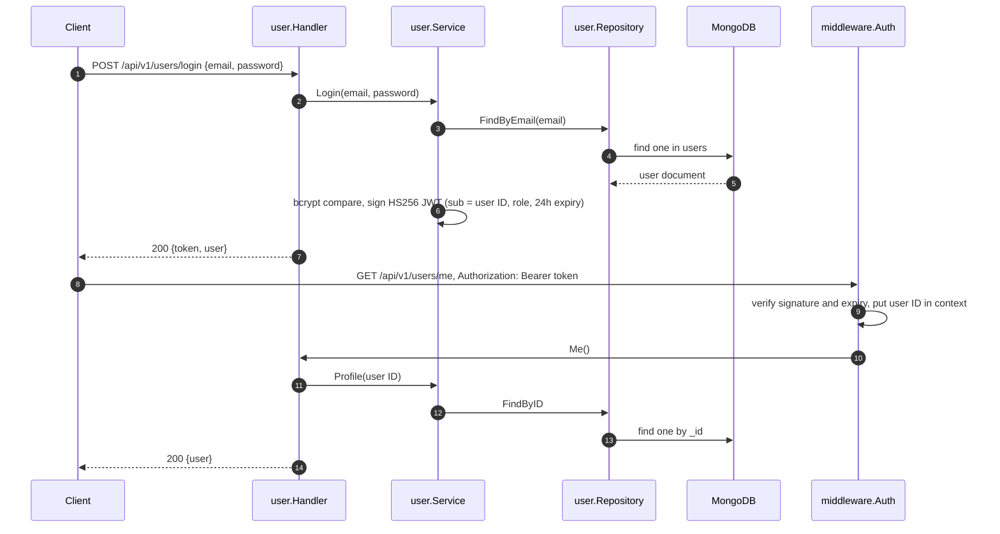
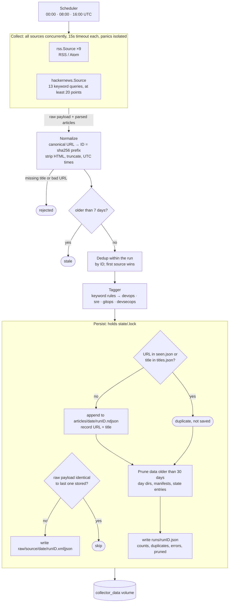

# Backend

This directory holds the Go code for Arium. It builds two independent programs from one module
(`github.com/fmolinar/arium/backend`):

| Program | Entry point | What it does |
|---|---|---|
| **API** | `cmd/api` | HTTP JSON API: health check, user registration/login (JWT) and profile, and the news feed. Stores users and news in MongoDB. |
| **News collector** | `cmd/collector` | Pulls DevOps/SRE/GitOps/DevSecOps news from RSS/Atom feeds and Hacker News three times a day, keeps 30 days of deduplicated articles on a volume, and syncs them into MongoDB. |

The two never call each other: the collector writes articles to its volume and syncs them into MongoDB, and the
API reads them from there.



## Software stack

| | |
|---|---|
| Language | Go 1.25 |
| HTTP router | [chi v5](https://github.com/go-chi/chi) + [go-chi/cors](https://github.com/go-chi/cors) |
| Database | MongoDB via [mongo-driver v2](https://github.com/mongodb/mongo-go-driver) |
| Auth | [golang-jwt v5](https://github.com/golang-jwt/jwt) (HS256), passwords hashed with bcrypt (`golang.org/x/crypto`) |
| Feed parsing | [gofeed](https://github.com/mmcdole/gofeed) (RSS 2.0 and Atom) |
| Tests | standard `testing` + `net/http/httptest`; integration tests against a real MongoDB |
| Container | multi-stage builds on `golang:1.25-alpine` → `alpine:3.22`, non-root user (see [`devops/docker`](../devops/docker)) |

## Layout

```text
backend/
├── cmd/
│   ├── api/main.go             # API entry point: config → Mongo → repositories/services/handlers → server
│   └── collector/
│       ├── main.go             # Collector CLI: flags, run-once or schedule mode
│       ├── config.go           # Loads and validates sources.json
│       ├── sync.go             # Syncs stored articles into MongoDB after each run
│       ├── health.go           # Heartbeat file and -healthcheck
│       └── sources.json        # Default feeds and Hacker News queries (embedded in the binary)
├── internal/
│   ├── config/                 # API configuration from environment variables
│   ├── database/               # MongoDB connection
│   ├── middleware/             # JWT auth, CORS, request logging
│   ├── server/                 # chi router, global middleware, /health, HTTP server
│   ├── user/                   # User feature: model → repository → service → handler → routes
│   ├── news/                   # News feed: same layering; also the Mongo import used by the collector
│   └── collector/              # News pipeline: collect, normalize, tag, deduplicate, store, prune, schedule
│       ├── rss/                # RSS/Atom source
│       └── hackernews/         # Hacker News source
├── pkg/response/               # Shared JSON response helpers
├── tests/integration/          # End-to-end API tests (build tag: integration)
└── migrations/                 # Reserved for data migration scripts
```

## API

### Endpoints

| Method | Path | Auth | Description |
|---|---|---|---|
| `GET` | `/health` | – | `200 {"status":"healthy"}` if MongoDB answers a ping within 2s, else `503` |
| `POST` | `/api/v1/users/register` | – | Create a user (`name`, `email`, `password`) and return `{token, user}` |
| `POST` | `/api/v1/users/login` | – | Check credentials and return `{token, user}` |
| `GET` | `/api/v1/users/me` | Bearer JWT | Current user's profile |
| `PATCH` | `/api/v1/users/me` | Bearer JWT | Update the current user's `name` |
| `GET` | `/api/v1/news` | – | News, newest first: `{items, nextCursor}`. Query: `tag` (`devops`/`sre`/`gitops`/`devsecops`), `limit` (1–100, default 20), `cursor` (a previous `nextCursor`) |

Errors are always `{"error": "<message>"}` with a matching status code.

### How a request flows

`cmd/api/main.go` wires everything by hand (no DI framework). Each feature is layered the same way:
**routes → handler → service → repository → MongoDB**.



What happens on login, and on a later authenticated call:



### Design notes

- **Auth uses JWT, not sessions.** The API stays stateless: tokens are HS256 with a 24-hour expiry and carry the
  user ID (`sub`) and a `role` claim. `middleware.Auth` is applied per route group, not globally.
- **Configuration comes only from environment variables** (`internal/config`) and is passed down explicitly
  rather than read from globals. `JWT_SECRET` is required, and the API refuses to start without it.
- **Graceful shutdown:** on SIGINT/SIGTERM, in-flight requests get up to 10 seconds to finish, then the Mongo
  connection is closed.
- **Adding a feature:** create `internal/<feature>/` with the same model/repository/service/handler/routes split
  and mount it in `server.go`.

### Configuration

| Variable | Default | |
|---|---|---|
| `JWT_SECRET` | **required** | HMAC key for signing tokens (`openssl rand -base64 32`) |
| `ADDRESS` | `:8080` | Listen address |
| `FRONTEND_URL` | `http://localhost:3000` | Origin allowed by CORS |
| `MONGO_URI` | `mongodb://localhost:27017/arium` | MongoDB connection string |
| `MONGO_DB` | `arium` | Database name |

## News collector

The collector is a standalone program. By default it runs once and exits. With `-schedule` (which is how it
runs in Docker) it stays up and collects at fixed times every day.

### Data flow



### What's on the volume

```text
/data
├── raw/<source>/<YYYY-MM-DD>/<runID>.xml|json   # upstream response, verbatim, only when it changed
├── articles/<YYYY-MM-DD>/<runID>.ndjson         # one normalized article per line, new in this run
├── runs/<runID>.json                            # manifest, written last: its presence means the run finished
└── state/
    ├── seen.json                                # article ID → first seen
    ├── titles.json                              # normalized title → first seen
    ├── raw.json                                 # source → sha256 of last stored payload
    └── .lock                                    # flock held while a run writes
```

Each article uses the same JSON shape as the frontend's news items:

```json
{"id":"9986f806dbfc29e0","title":"…","summary":"…","source":"openssf.org","url":"https://…",
 "tags":["devsecops"],"publishedAt":"2026-09-24T19:32:24Z","fetchedAt":"…","origin":"openssf-blog"}
```

### Run policy

- **Schedule:** 3 times a day, every day (`COLLECTOR_SCHEDULE`, `COLLECTOR_TIMEZONE`). Runs missed while the
  collector is down are not made up, and a failed run doesn't stop the schedule. With `-run-on-start`
  (`COLLECTOR_RUN_ON_START`, on in Docker Compose) it also runs once at startup, so a fresh deploy has news
  without waiting for the next scheduled time.
- **Duplicates are never saved.** An article is skipped if its canonical URL or its normalized title was already
  stored; titles under 4 words are compared by URL only. Raw payloads identical to the last one stored are
  skipped.
- **Retention:** 30 days (`COLLECTOR_RETENTION`). `-since` must be ≤ `-retention` so pruned articles can't come
  back.
- **Failures:** a failed source is recorded in the manifest and the others carry on. A one-off run exits
  non-zero only if *every* source fails.
- **Health:** before each wait the scheduler writes the next run time to a heartbeat file. `-healthcheck` fails
  if that run is more than 10 minutes overdue, meaning the loop died or a run is hung.
- **MongoDB sync:** after each run, every article on the volume fetched within the retention window is upserted
  into the `news` collection by `id`, and older ones are deleted. Re-importing everything keeps the sync
  idempotent and lets a run that couldn't reach MongoDB be caught up by the next one; a failed sync fails the run.
- **Concurrency:** a lock file stops a manual `-once` run and the scheduled run from writing at the same time.
- **Delivery is at-least-once:** a crash between writing articles and saving state can repeat some articles in
  the next run, so consumers should deduplicate by `id`.

### Flags

| Flag | Env var | Default | |
|---|---|---|---|
| `-out` | `COLLECTOR_OUT_DIR` | `./data` | Output directory |
| `-sources` | `COLLECTOR_SOURCES` | built-in `sources.json` | Custom feeds / Hacker News queries |
| `-schedule` | `COLLECTOR_SCHEDULE` | empty = run once | Daily run times, `HH:MM,HH:MM,...` |
| `-timezone` | `COLLECTOR_TIMEZONE` | `UTC` | Time zone for `-schedule` |
| `-run-on-start` | `COLLECTOR_RUN_ON_START` | `false` | With `-schedule`, also run once at startup |
| `-retention` | `COLLECTOR_RETENTION` | `720h` | Delete stored data older than this; `0` keeps everything |
| `-since` | `COLLECTOR_SINCE` | `168h` | Ignore articles older than this |
| `-timeout` | `COLLECTOR_SOURCE_TIMEOUT` | `15s` | Per-source timeout |
| `-health-file` | `COLLECTOR_HEALTH_FILE` | `$TMPDIR/collector-heartbeat.json` | Heartbeat written in schedule mode |
| `-healthcheck` | | | Exit non-zero if the next scheduled run is overdue |
| `-mongo-uri` | `MONGO_URI` | empty = no sync | Sync stored articles into this MongoDB after each run |
| `-mongo-db` | `MONGO_DB` | `arium` | Database for `-mongo-uri` |
| `-once` | | | Run once even if a schedule is set |
| `-dry-run` | | | Print articles as NDJSON, write nothing |

## Running and testing

```sh
cd backend

# API
cp .env.example .env                 # set JWT_SECRET
go run ./cmd/api

# Collector
go run ./cmd/collector -dry-run      # fetch live sources and print, write nothing
go run ./cmd/collector               # run once, write to ./data (gitignored)
go run ./cmd/collector -schedule 00:00,08:00,16:00

# Checks (the same ones CI runs)
gofmt -l .                           # must print nothing
go vet ./...
go test ./...                        # unit tests; no network or Docker needed

# Integration tests: the real HTTP server against MongoDB, in a throwaway database
docker run -d --rm -p 27017:27017 mongo:latest
go test -tags=integration ./tests/integration/...   # TEST_MONGO_URI overrides the address
```

To run the whole stack, API and collector included, in Docker, see [`devops/docker`](../devops/docker).
