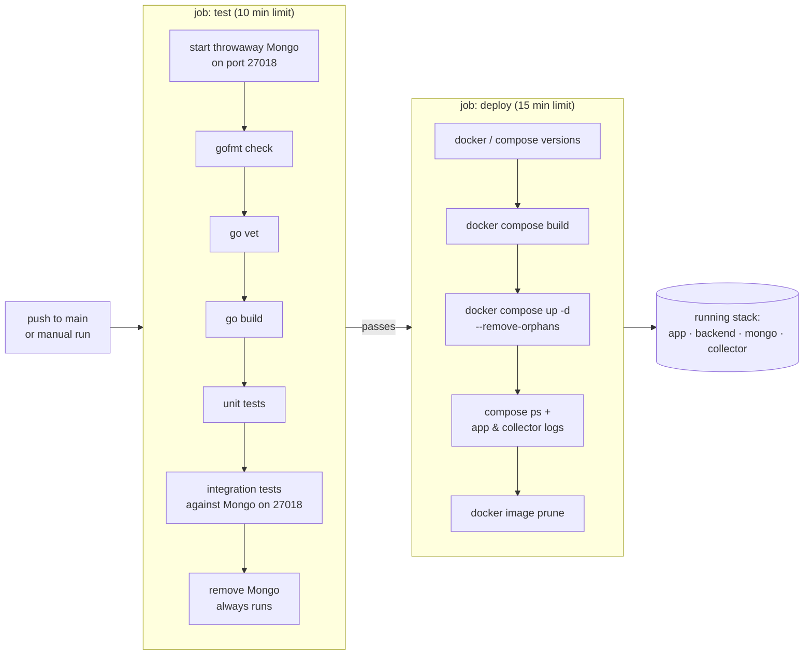

# DevOps (`devops/`)

This directory holds everything needed to build, deploy and run Arium. Today that's Docker Compose, deployed by
GitHub Actions to a self-hosted runner. The `jenkins/` and `kubernetes/` directories are placeholders for
upcoming work and aren't in the repository yet.

| Directory | Status | Contents |
|---|---|---|
| [`docker/`](docker) | in use | Dockerfiles for the frontend, API and collector, and the Compose stack |
| `jenkins/` | planned | Jenkins pipeline |
| `kubernetes/` | planned | Kubernetes manifests (the collector's schedule maps naturally onto a `CronJob`) |

## Software stack

| | |
|---|---|
| Containers | Docker, multi-stage builds, non-root runtime users |
| Orchestration | Docker Compose (`devops/docker/compose.yaml`) |
| CI/CD | GitHub Actions ([`.github/workflows/deploy-local.yaml`](../.github/workflows/deploy-local.yaml)) on a **self-hosted** runner |
| Secrets | `JWT_SECRET` comes from a GitHub Actions secret in CI, and from `devops/docker/.env` locally |

## CI/CD pipeline

Every push to `main` (or a manual `workflow_dispatch`) tests the backend and then redeploys the stack on the
machine that hosts the runner. A newer push cancels a deploy that's still in progress.

- **Why port 27018:** the test job's MongoDB uses host port 27018 because the deployed stack's MongoDB already
  holds 27017 on the same machine.
- **Deploying means replacing in place:** `compose up -d` recreates only containers whose image or configuration
  changed. Named volumes (`mongo_data`, `collector_data`) survive redeploys.
- **Not in CI yet:** frontend lint and build checks, and a post-deploy health check against `/health`.

See [`docker/README.md`](docker) for the services, images and volumes.
