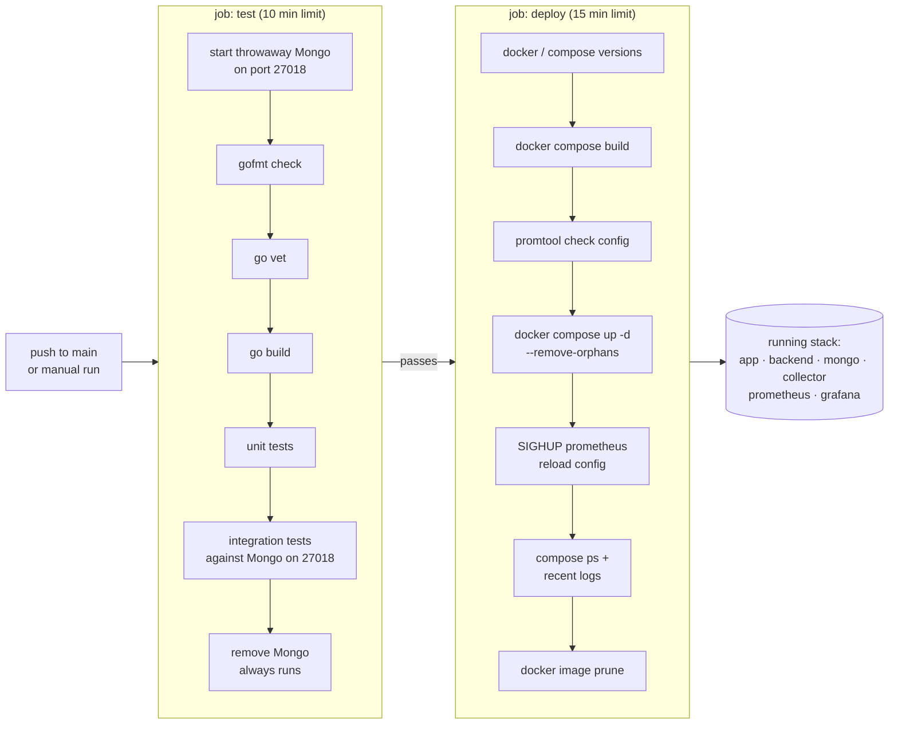

# DevOps (`devops/`)

This directory holds everything needed to build, deploy and run Arium. Today that's Docker Compose, deployed by
GitHub Actions to a self-hosted runner. The `jenkins/` and `kubernetes/` directories are placeholders for
upcoming work and aren't in the repository yet.

| Directory | Status | Contents |
|---|---|---|
| [`docker/`](docker) | in use | Dockerfiles for the frontend, API and collector, and the Compose stack |
| [`observability/`](observability) | in use | Prometheus scrape config, Grafana datasource and dashboards |
| [`terraform/`](terraform) | in use | The news collector on AWS Lambda, scheduled by EventBridge, writing to MongoDB Atlas |
| `jenkins/` | planned | Jenkins pipeline |
| `kubernetes/` | planned | Kubernetes manifests (the collector's schedule maps naturally onto a `CronJob`) |

## Software stack

| | |
|---|---|
| Containers | Docker, multi-stage builds, non-root runtime users |
| Orchestration | Docker Compose (`devops/docker/compose.yaml`) |
| CI/CD | GitHub Actions ([`.github/workflows/deploy-local.yaml`](../.github/workflows/deploy-local.yaml)) on a **self-hosted** runner |
| Secrets | `JWT_SECRET` comes from a GitHub Actions secret in CI, and from `devops/docker/.env` locally |
| Observability | OpenTelemetry metrics → Prometheus → Grafana, JSON logs via `log/slog` |

## CI/CD pipeline

Every push to `main` (or a manual `workflow_dispatch`) tests the backend and then redeploys the stack on the
machine that hosts the runner. A newer push cancels a deploy that's still in progress.

```mermaid
flowchart LR
    push["push to main<br/>or manual run"] --> test

    subgraph test ["job: test (10 min limit)"]
        direction TB
        mongo["start throwaway Mongo<br/>on port 27018"] --> fmt["gofmt check"] --> vet["go vet"] --> build["go build"] --> unit["unit tests"] --> integ["integration tests<br/>against Mongo on 27018"]
        integ --> stop["remove Mongo<br/>always runs"]
    end

    test -- "passes" --> deploy

    subgraph deploy ["job: deploy (15 min limit)"]
        direction TB
        verify["docker / compose versions"] --> images["docker compose build"] --> promtool["promtool check config"] --> up["docker compose up -d<br/>--remove-orphans"] --> reload["SIGHUP prometheus<br/>reload config"] --> status["compose ps +<br/>recent logs"] --> prune["docker image prune"]
    end

    deploy --> stack[("running stack:<br/>app · backend · mongo · collector<br/>prometheus · grafana")]
```

- **Why port 27018:** the test job's MongoDB uses host port 27018 because the deployed stack's MongoDB already
  holds 27017 on the same machine.
- **Deploying means replacing in place:** `compose up -d` recreates only containers whose image or configuration
  changed. Named volumes (`mongo_data`, `collector_data`, `prometheus_data`, `grafana_data`) survive redeploys.
  Prometheus and Grafana read their config and dashboards from bind mounts, so `compose up` doesn't recreate them
  when only those files change. The deploy job therefore sends Prometheus a `SIGHUP` to reload `prometheus.yml`,
  and Grafana reloads dashboards from disk every 30s. (Datasource changes need `docker compose restart grafana`.)
- **Not in CI yet:** frontend lint and build checks, and a post-deploy health check against `/health`.

See [`docker/README.md`](docker) for the services, images and volumes.
