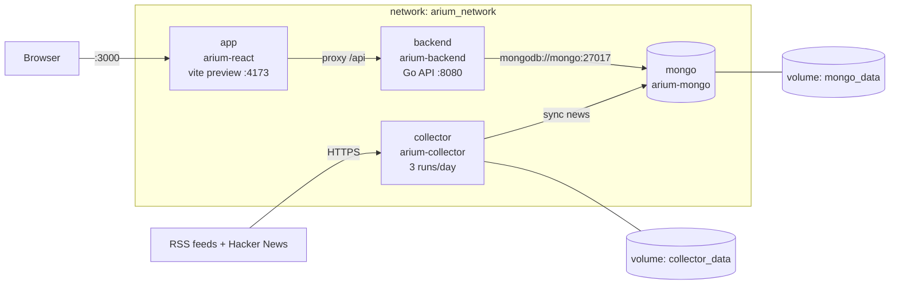

# Docker (`devops/docker/`)

This directory has the Dockerfiles and the Compose file that run the whole Arium stack on one machine. CI deploys
the stack from here (see [`devops/`](..)), and you can run the same stack locally.

## Services



| Service | Image (Dockerfile) | Ports (host → container) | Storage | Restart |
|---|---|---|---|---|
| `app` | `arium-react` ([`Dockerfile`](Dockerfile)) | 3000 → 4173 | – | unless-stopped |
| `backend` | `arium-backend` ([`Dockerfile.backend`](Dockerfile.backend)) | 8080 → 8080 | – | unless-stopped |
| `mongo` | `mongo:latest` | 27017 → 27017 | `mongo_data` → `/data/db` | unless-stopped |
| `collector` | `arium-collector` ([`Dockerfile.collector`](Dockerfile.collector)) | none | `collector_data` → `/data` | unless-stopped |

The browser calls the API at relative `/api` URLs on port 3000, and `vite preview` in the `app` container
proxies them to `backend` (`API_PROXY_TARGET=http://backend:8080`), so those requests are same-origin. The API's
port 8080 is still published for direct calls, and its CORS policy allows `FRONTEND_URL` (`http://localhost:3000`). The collector fetches
sources over HTTPS and, after each run, syncs articles into Mongo's `news` collection over `arium_network`. Its healthcheck runs `collector -healthcheck` every minute
and marks the container unhealthy once a scheduled run is more than 10 minutes overdue.

## Images

| Dockerfile | Build | Runtime |
|---|---|---|
| `Dockerfile` | `node:22-alpine`: `npm ci`, `npm run build` | same image, serves `dist/` with `vite preview --host 0.0.0.0` |
| `Dockerfile.backend` | `golang:1.25-alpine`: static `CGO_ENABLED=0` binary | `alpine:3.22`, CA certificates, non-root `app` user |
| `Dockerfile.collector` | `golang:1.25-alpine`: static binary with embedded tzdata | `alpine:3.22`, CA certificates, non-root `app` user, `/data` pre-created and owned by `app` so a fresh volume is writable |

All builds use the repository root as the build context. `.dockerignore` keeps out `node_modules`, build output,
`.env` files and local collector data.

## Configuration

Compose reads `devops/docker/.env`, which is gitignored. Copy [`.env.example`](.env.example) to get started.

| Variable | Used by | Default | |
|---|---|---|---|
| `JWT_SECRET` | backend | **required**: compose won't start without it | `openssl rand -base64 32` |
| `COLLECTOR_SCHEDULE` | collector | `00:00,08:00,16:00` | Daily run times |
| `COLLECTOR_TIMEZONE` | collector | `UTC` | e.g. `America/Los_Angeles` |
| `COLLECTOR_RUN_ON_START` | collector | `true` | Also collect once when the container starts |
| `COLLECTOR_RETENTION` | collector | `720h` | Keep 30 days of data |
| `COLLECTOR_SINCE` | collector | `168h` | Ignore articles older than 7 days (must be ≤ retention) |
| `COLLECTOR_SOURCE_TIMEOUT` | collector | `15s` | Per-source timeout |

The backend's `MONGO_URI`, `MONGO_DB`, `ADDRESS` and `FRONTEND_URL` are set in `compose.yaml` itself.

## Commands

```sh
cd devops/docker
cp .env.example .env                        # then set JWT_SECRET

docker compose up -d --build                # build and start everything
docker compose ps
docker compose logs -f backend              # or app / mongo / collector
docker compose down                         # stop; volumes are kept
docker compose down -v                      # stop and DELETE mongo_data and collector_data

# Collector
docker compose logs -f collector            # runs, and the next scheduled time
docker compose run --rm collector -once     # collect right now, alongside the scheduler
docker run --rm -v docker_collector_data:/data alpine ls -R /data   # browse the volume
```

Volume names get the Compose project name as a prefix (by default `docker`, the directory name), which is why the
collector volume appears as `docker_collector_data`.

## Caveats

- MongoDB is published on host port 27017 with no authentication. That's fine for a local machine, but don't
  expose it beyond that.
- `depends_on: mongo` only orders startup; mongo and backend have no healthcheck. The backend can start before MongoDB accepts
  connections, and `restart: unless-stopped` retries it.
