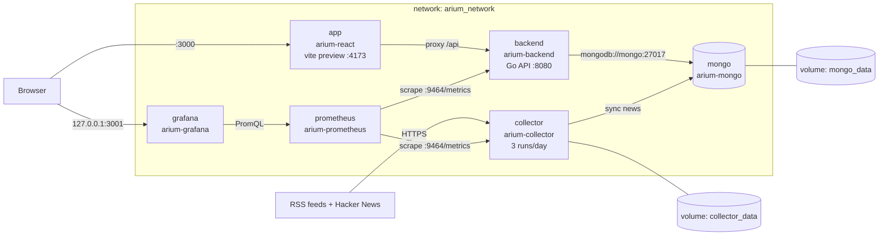

# Docker (`devops/docker/`)

This directory has the Dockerfiles and the Compose file that run the whole Arium stack on one machine. CI deploys
the stack from here (see [`devops/`](..)), and you can run the same stack locally.

## Services


```mermaid
flowchart LR
    user["Browser"] -- ":3000" --> app["app<br/>arium-react<br/>vite preview :4173"]
    app -- "proxy /api" --> backend["backend<br/>arium-backend<br/>Go API :8080"]
    backend -- "mongodb://mongo:27017" --> mongo[("mongo<br/>arium-mongo")]
    mongo --- mongoVol[("volume: mongo_data")]

    internet["RSS feeds + Hacker News"] -- "HTTPS" --> collector["collector<br/>arium-collector<br/>3 runs/day"]
    collector --- colVol[("volume: collector_data")]
    collector -- "sync news" --> mongo

    prometheus["prometheus<br/>arium-prometheus"] -- "scrape :9464/metrics" --> backend
    prometheus -- "scrape :9464/metrics" --> collector
    grafana["grafana<br/>arium-grafana"] -- "PromQL" --> prometheus
    user -- "127.0.0.1:3001" --> grafana

    subgraph net ["network: arium_network"]
        app
        backend
        mongo
        collector
        prometheus
        grafana
    end
```

| Service | Image (Dockerfile) | Ports (host → container) | Storage | Restart |
|---|---|---|---|---|
| `app` | `arium-react` ([`Dockerfile`](Dockerfile)) | 3000 → 4173 | – | unless-stopped |
| `backend` | `arium-backend` ([`Dockerfile.backend`](Dockerfile.backend)) | 127.0.0.1:8080 → 8080 | – | unless-stopped |
| `mongo` | `mongo:latest` | 127.0.0.1:27017 → 27017 | `mongo_data` → `/data/db` | unless-stopped |
| `collector` | `arium-collector` ([`Dockerfile.collector`](Dockerfile.collector)) | none | `collector_data` → `/data` | unless-stopped |
| `prometheus` | `prom/prometheus:v3.15.0` | 127.0.0.1:9090 → 9090 | `prometheus_data` → `/prometheus` | unless-stopped |
| `grafana` | `grafana/grafana:13.2.3` | 127.0.0.1:3001 → 3000 | `grafana_data` → `/var/lib/grafana` | unless-stopped |

The browser calls the API at relative `/api` URLs on port 3000, and `vite preview` in the `app` container
proxies them to `backend` (`API_PROXY_TARGET=http://backend:8080`), so those requests are same-origin. The API's
port 8080 is published on 127.0.0.1 only, for direct local calls, and its CORS policy allows `FRONTEND_URL` (`http://localhost:3000`). The collector fetches
sources over HTTPS and, after each run, syncs articles into Mongo's `news` collection over `arium_network`. Its healthcheck runs `collector -healthcheck` every minute
and marks the container unhealthy once a scheduled run is more than 10 minutes overdue.

The backend and collector serve Prometheus metrics on port 9464, which is reachable only on `arium_network`.
Prometheus scrapes them every 15s, and Grafana reads Prometheus. Their configuration, datasource and dashboards
are mounted read-only from [`devops/observability`](../observability). Both publish their ports on 127.0.0.1 only.

## Images

| Dockerfile | Build | Runtime |
|---|---|---|
| `Dockerfile` | `node:22-alpine`: `npm ci`, `npm run build` | same image, serves `dist/` with `vite preview --host 0.0.0.0` |
| `Dockerfile.backend` | `golang:1.27-alpine`: static `CGO_ENABLED=0` binary | `alpine:3.22`, CA certificates, non-root `app` user |
| `Dockerfile.collector` | `golang:1.27-alpine`: static binary with embedded tzdata | `alpine:3.22`, CA certificates, non-root `app` user, `/data` pre-created and owned by `app` so a fresh volume is writable |

All builds use the repository root as the build context. `.dockerignore` keeps out `node_modules`, build output,
`.env` files and local collector data.

## Configuration

Compose reads `devops/docker/.env`, which is gitignored. Copy [`.env.example`](.env.example) to get started.

| Variable | Used by | Default | |
|---|---|---|---|
| `JWT_SECRET` | backend | **required**: compose won't start without it | `openssl rand -base64 32` |
| `MONGO_URI` | backend | `mongodb://mongo:27017/arium` | Set to the Atlas connection string to serve what the Lambda collector writes. The `collector` service always syncs to the local `mongo` |
| `MONGO_DB` | backend | `arium` | Database name |
| `COLLECTOR_SCHEDULE` | collector | `00:00,08:00,16:00` | Daily run times |
| `COLLECTOR_TIMEZONE` | collector | `UTC` | e.g. `America/Los_Angeles` |
| `COLLECTOR_RUN_ON_START` | collector | `true` | Also collect once when the container starts |
| `COLLECTOR_RETENTION` | collector | `720h` | Keep 30 days of data |
| `COLLECTOR_SINCE` | collector | `168h` | Ignore articles older than 7 days (must be ≤ retention) |
| `COLLECTOR_SOURCE_TIMEOUT` | collector | `15s` | Per-source timeout |
| `LOG_LEVEL` | backend, collector | `info` | `debug`, `info`, `warn` or `error` |
| `GRAFANA_ADMIN_PASSWORD` | grafana | `admin` | Password for the `admin` user. Applied when `grafana_data` is first created |
| `PROMETHEUS_RETENTION` | prometheus | `15d` | How long Prometheus keeps metrics |

The backend's `ADDRESS` and `FRONTEND_URL` are set in `compose.yaml` itself. In CI the deploy job takes `JWT_SECRET`
and `MONGO_URI` from the GitHub secrets of the same names.

## Commands

```sh
cd devops/docker
cp .env.example .env                        # then set JWT_SECRET

docker compose up -d --build                # build and start everything
docker compose ps
docker compose logs -f backend              # or app / mongo / collector
docker compose down                         # stop; volumes are kept
docker compose down -v                      # stop and DELETE all volumes (Mongo, collector, Prometheus, Grafana data)

# Collector
docker compose logs -f collector            # runs, and the next scheduled time
docker compose run --rm collector -once     # collect right now, alongside the scheduler
docker run --rm -v docker_collector_data:/data alpine ls -R /data   # browse the volume

# Observability
open http://localhost:3001                  # Grafana (admin / GRAFANA_ADMIN_PASSWORD): Arium folder
open http://localhost:9090/targets          # Prometheus scrape targets: api and collector should be UP
docker compose logs backend | jq 'select(.msg == "request")'   # logs are JSON lines
```

Volume names get the Compose project name as a prefix (by default `docker`, the directory name), which is why the
collector volume appears as `docker_collector_data`.

## Caveats

- Grafana's admin password defaults to `admin`. Grafana and Prometheus listen only on 127.0.0.1, but set
  `GRAFANA_ADMIN_PASSWORD` anyway if the host is shared.
- MongoDB has no authentication, so it's published on 127.0.0.1:27017 only, like the API on 127.0.0.1:8080. Only the
  app's port 3000 listens on all interfaces, for the Cloudflare Tunnel connector to reach through `host.docker.internal`.
- `depends_on: mongo` only orders startup; mongo and backend have no healthcheck. The backend can start before MongoDB accepts
  connections, and `restart: unless-stopped` retries it.
