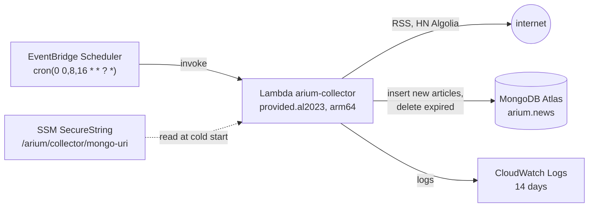

# Terraform: news collector on AWS Lambda (`devops/terraform/`)

Runs the news collector (`backend/cmd/collector`) as an AWS Lambda function on a schedule, writing articles
straight to MongoDB Atlas. It's the cloud counterpart of the `collector` service in Docker Compose, and the stack is
cheap to create and destroy.



## How the Lambda differs from the Compose collector

Same binary, same sources and normalization. It switches to Lambda mode when `AWS_LAMBDA_RUNTIME_API` is set.

| | Compose collector | Lambda |
|---|---|---|
| Trigger | in-process scheduler (`-schedule`) | EventBridge Scheduler |
| Dedup state | `state/*.json` on the `collector_data` volume | MongoDB itself (`_id`, `title_key`) |
| Writes | files, then a full re-import into Mongo | insert-only into Mongo (`news.Service.Ingest`); stored articles keep their first `fetched_at` |
| Raw payloads, manifests | kept on the volume | not kept |
| Retention | prunes files and Mongo | deletes from Mongo by `fetched_at` |
| Observability | JSON logs on stdout, Prometheus scrapes `/metrics` | JSON logs to CloudWatch; no `/metrics`, since nothing can scrape a function between invocations |

## Cost

At three runs a day, about 5 s each, the function, scheduler and logs stay within the AWS free tier. The SSM
standard parameter is free. The function runs outside a VPC, so there's no NAT gateway, which would be the
expensive part (about $32 a month). `terraform destroy` removes everything this stack creates.

## Prerequisites

- Terraform >= 1.6, and Go 1.25 or Docker (`build.sh` falls back to the `golang:1.25` image)
- AWS credentials Terraform can use, e.g. `aws configure` / `AWS_PROFILE`. The AWS CLI is optional but needed for
  `invoke_command` and log tailing.
- An Atlas cluster. Because Lambda outside a VPC has no fixed egress IP, Atlas **Network Access** must allow
  `0.0.0.0/0` (the free tier can't use private endpoints). The database user needs `readWrite` on `arium` (it also
  creates the indexes).

## Usage

```sh
cd devops/terraform

./build.sh                                   # builds build/bootstrap (linux/arm64)

# The URI from the repo-root .env (Atlas onboarding), without echoing it:
export TF_VAR_mongo_uri="$(grep '^MONGODB_URI=' ../../.env | cut -d= -f2- | tr -d '"')"

terraform init
terraform apply                              # pick the region closest to Atlas: -var aws_region=...

# Run once now instead of waiting for the next slot, and print the logs:
eval "$(terraform output -raw invoke_command)"

terraform destroy                            # tear it all down
```

Rerun `./build.sh` before `terraform apply` after changing backend code. `source_code_hash` makes Terraform
redeploy only when the binary changes. Set `schedule_enabled = false` to keep the function but only invoke it by hand.

A successful run logs a line like:

```json
{"level":"INFO","msg":"run stored","new":19,"duplicates_by_url":0,"duplicates_by_title":0,"expired":0,"sources":10}
```

`aws lambda invoke` prints `null` on success. Runs that fail (every source failed, or MongoDB unreachable)
return an error, which shows up in the function's `Errors` metric. Failed scheduled runs aren't retried. Runs
are idempotent, so the next one catches up.

## Showing the Atlas data in the frontend

The Lambda only writes. The frontend reads news through the API (`GET /api/v1/news`), so point the Compose
backend at the same cluster by setting `MONGO_URI` to the same connection string: in `devops/docker/.env` for a
manual `docker compose up`, or as the `MONGO_URI` GitHub secret for the deploy workflow. Unset, the backend keeps
using the local `mongo` service. The backend also stores users there, and it creates its indexes on startup, so
its database user needs `readWrite` on `arium` too, and Atlas Network Access must allow the Docker host's IP
(`0.0.0.0/0` already covers it).

The Compose `collector` keeps syncing to the local `mongo` either way. With the backend on Atlas, the Lambda is
the only thing writing news there.

## Testing locally without AWS

AWS's Runtime Interface Emulator runs the same handler against a local Mongo:

```sh
cd backend && CGO_ENABLED=0 GOOS=linux GOARCH=amd64 go build -tags lambda.norpc -o /tmp/rie/bootstrap ./cmd/collector
docker network create rie && docker run -d --rm --name rie-mongo --network rie mongo:latest
docker run --rm --network rie -p 9000:8080 -v /tmp/rie:/var/task:ro \
  -e MONGO_URI=mongodb://rie-mongo:27017 public.ecr.aws/lambda/provided:al2023 bootstrap
curl -XPOST localhost:9000/2015-03-31/functions/function/invocations -d '{}'
```

## State and secrets

State is local (`terraform.tfstate`, gitignored) and contains the MongoDB URI, because Terraform writes the SSM
parameter. Running this from CI needs a remote backend (S3) first, or a destroy from another machine won't know
what exists.
